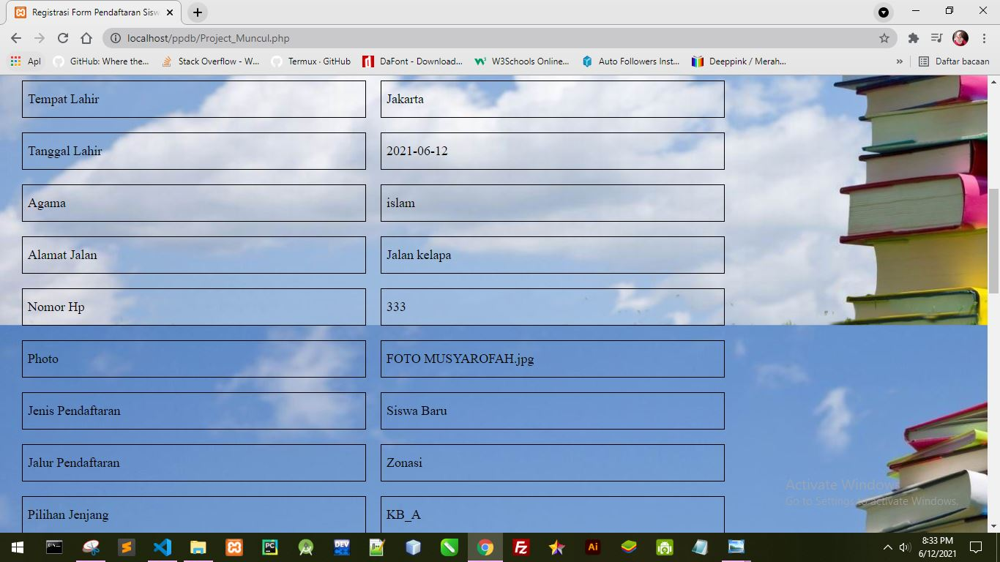

[//]: # (Nama project)
# Pendaftaran Peserta Didik Baru SD Kelompok 2 BSI 

[//]: # (Tema dan penjelasan project)
Sistem pendaftaran sekolah di Indonesia masih manual, orang tua dan anak harus datang ke sekolah membawa dokumen - dokumen yang diperlukan, hal tersebut menjadi masalah bagi orang tua yang tidak bisa datang. Banyak orang yang datang juga menyebabkan antrian panjang dan memakan waktu lama, sistem pendaftaran seperti ini tidak efektif.

Maka dari itu kami membuat website bertema *PPDB* untuk menyelesaikan masalah - masalah tersebut, dengan website *PPDB* ini para orang tua bisa mendaftarkan anaknya sekolah dimana saja, kapan saja dan tidak perlu mengantri.

Didalam website terdapat :
+ Halaman home yang berisikan tentang sekolah
+ Halaman Pendaftaran yang berisikan form pendaftaran
+ Halaman Hasil yang berisikan hasil seleksi dan *contact person*

#

### ⭐️ Keunggulan Website PPDB Kami
1. Memiliki banyak fitur
2. Tampilan yang mudah dipahami orang awam
3. Memudahkan Pendaftaran sekolah
4. Bisa diakses dimana saja
5. Bisa diakses kapan saja
6. Efektif
7. Efisien
8. Memudahkan pendataan bagi sekolah
#

### ⭐️ Nama Anggota Kelompok :

1. Fikry Rizky Mukjizat
    - Membuat PPT
2. Kristian Rosady
    - Membuat Coding Program
3. Musyarofah
    - Membuat Struktur Navigasi
    - Membuat Readme
#

### ⭐️ Fitur - fitur didalam website
1. Home
2. Pendaftaran
3. Hasil
#

### ⭐️ Screenshot/Implementasi web
> `Tampilan halaman 'Home'`

#

#

#
> `Tampilan halaman 'Pendaftaran'`

#

#

#

#

#
> `Hasil dari Form Pendaftaran`

#

#

#

#
> `Tampilan ketika captcha benar `

#

> `Tampilan ketika captcha salah `

#
> `Tampilan halaman 'Hasil' `

#

Copyright &copy; | Kelompok 2
#